# food_delivery

A new Flutter project.

## Getting Started

This project is a starting point for a Flutter application.

A few resources to get you started if this is your first Flutter project:

- [Lab: Write your first Flutter app](https://docs.flutter.dev/get-started/codelab)
- [Cookbook: Useful Flutter samples](https://docs.flutter.dev/cookbook)

For help getting started with Flutter development, view the
[online documentation](https://docs.flutter.dev/), which offers tutorials,
samples, guidance on mobile development, and a full API reference.

## App Screenshot

  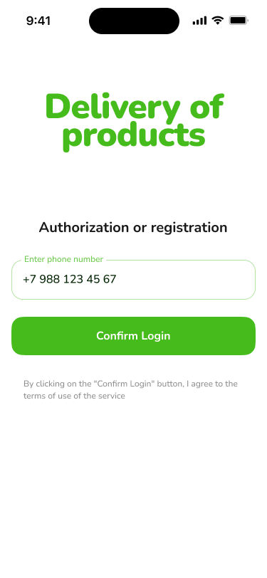
  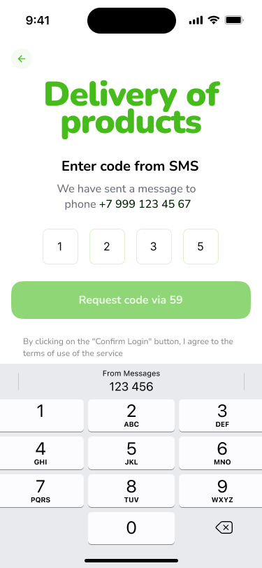
  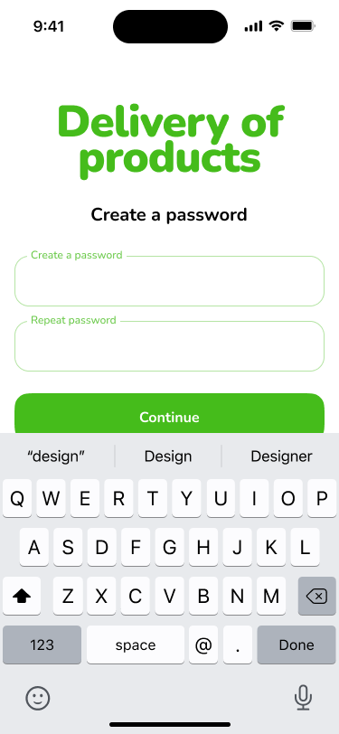

  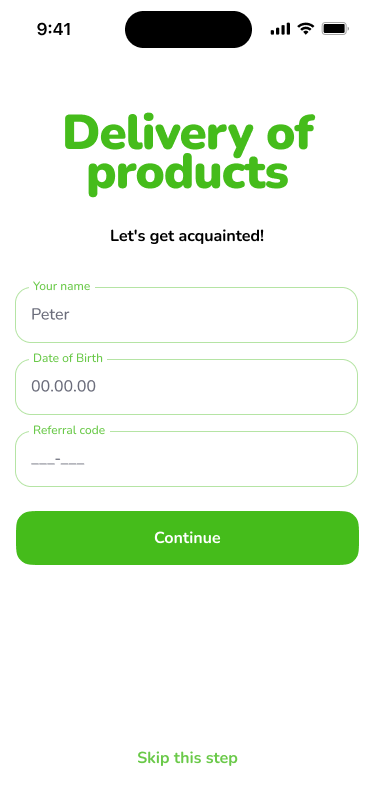
  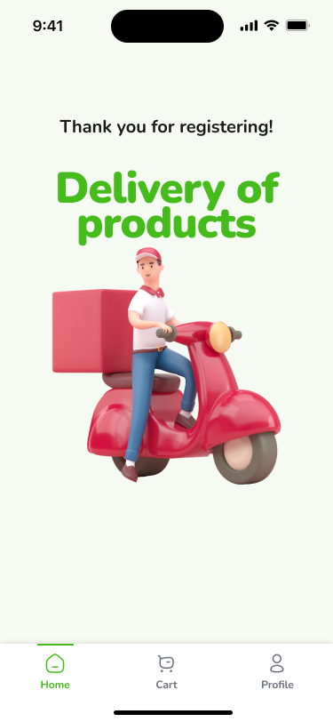
  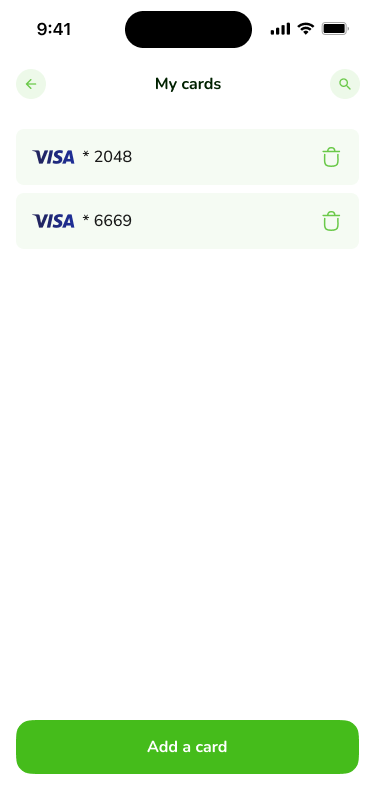

  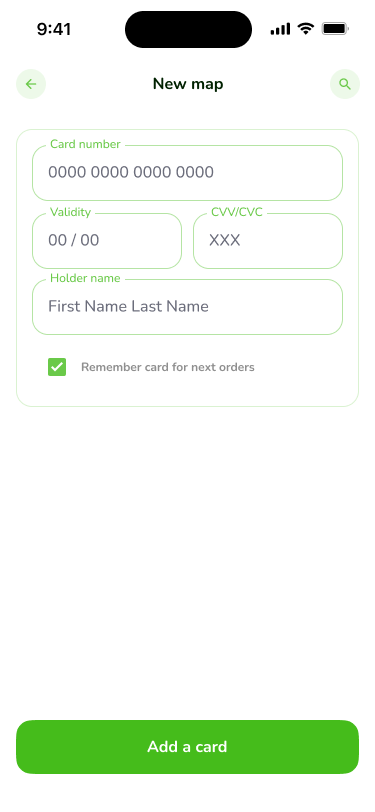
  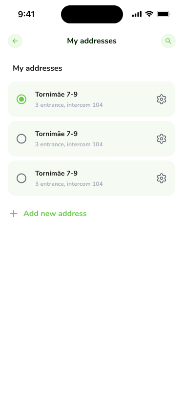
  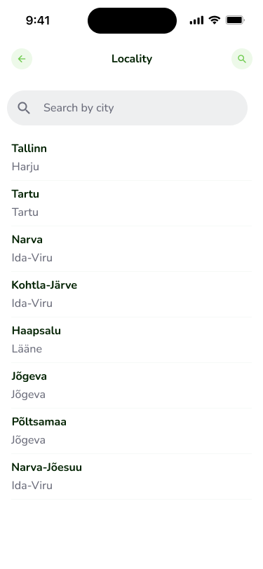

  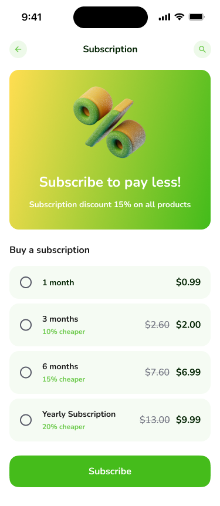
  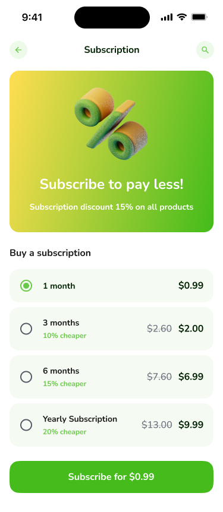
  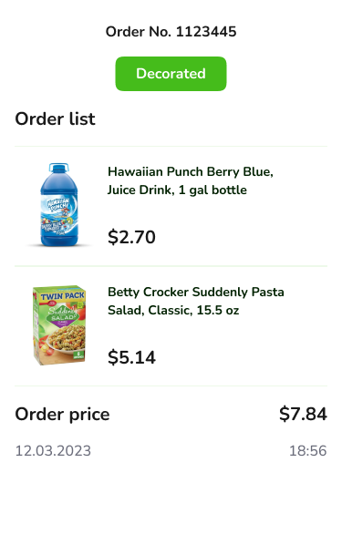

  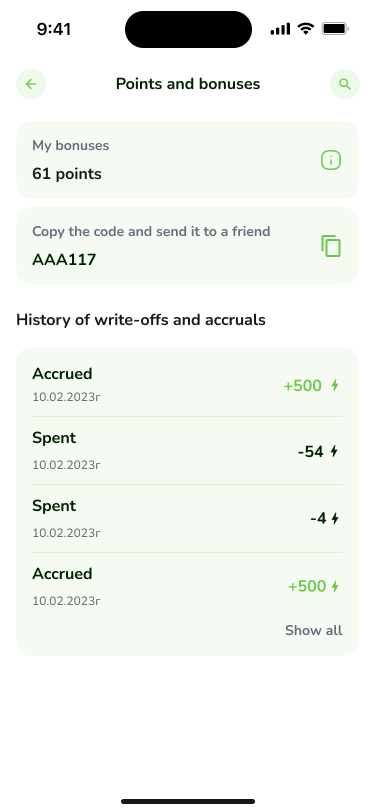
  
  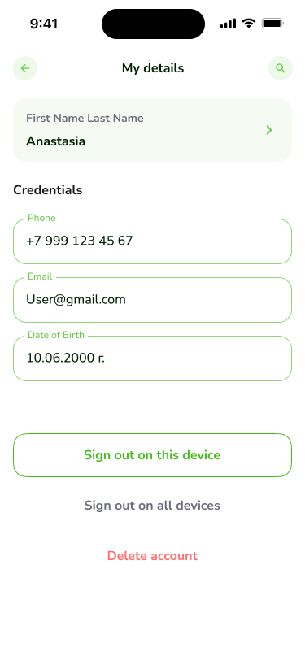

  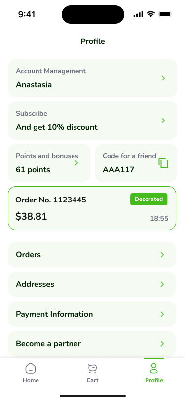
  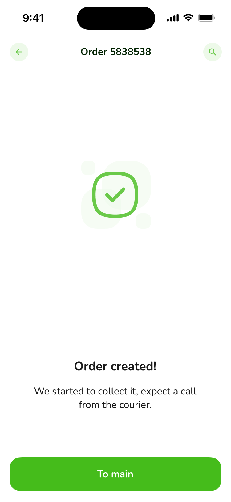
  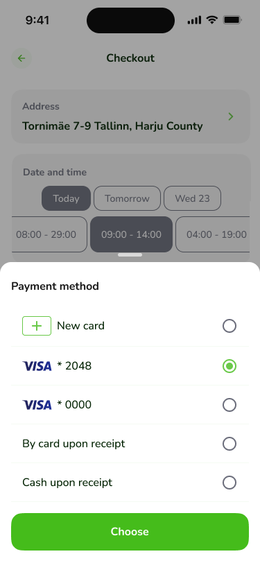

  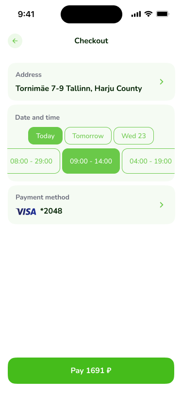
  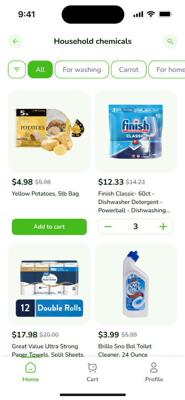

  
  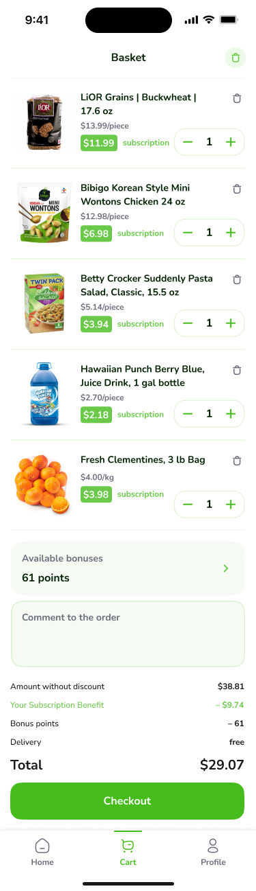
  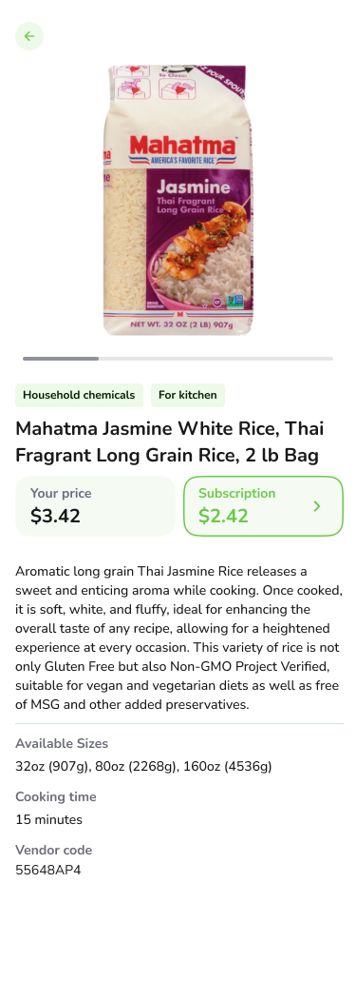

  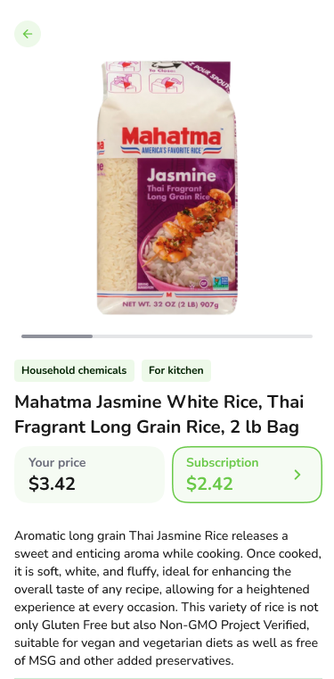

## For Runing In Your System
<h3> Follow these Steps </h3>

Step 1. git clone (copy repository path) 
Step 2. flutter pub get  
Step 3. flutter run  
